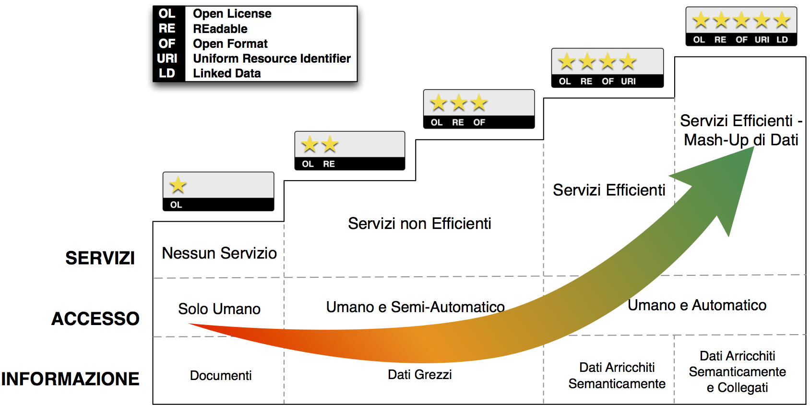

Modello di dati per i dati aperti [1]_
======================================

Si adotta il modello qualitativo per i dati aperti sul Web, noto come modello a cinque stelle.

In particolare, si tende a seguire un percorso graduale verso la produzione nativa di Linked Open Data – LOD (livello cinque stelle), iniziando dal livello 3. Produzione e pubblicazione di dati aperti solo di livello 1 e 2 non sono più ammessi: quest’ultimi devono essere accompagnati da quelli che rispecchiano le caratteristiche dei livelli 3 e/o superiori (per esempio, rilasciare dati strutturati solo in excel con licenza aperta non è ammesso; questi devono essere sempre affiancati da dati strutturati in formato non proprietario).

|image0|

**Figura 1: modello a 5 stelle per i dati aperti**

.. [1]
   Linee guida patrimonio informative pubblico –

   http://lg-patrimonio-pubblico.readthedocs.io/it/latest/dati.html

